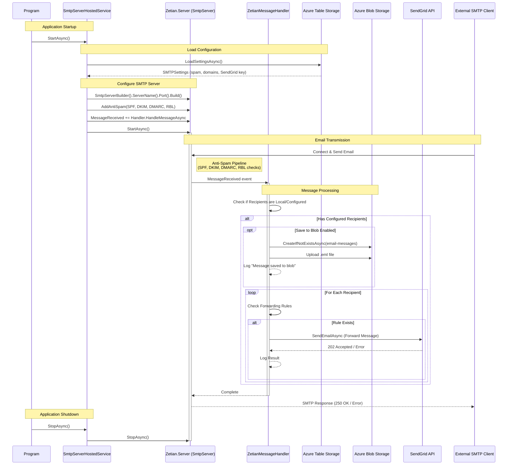

# BlazorSMTPForwarderSrv Code Flow

This diagram illustrates the startup and message processing flow of the SMTP Forwarder Service.

```mermaid
sequenceDiagram
    participant Program
    participant HostedService as SmtpServerHostedService
    participant Zetian as Zetian.Server (SmtpServer)
    participant Handler as ZetianMessageHandler
    participant Table as Azure Table Storage
    participant Blob as Azure Blob Storage
    participant SendGrid as SendGrid API
    participant Client as External SMTP Client

    Note over Program, HostedService: Application Startup
    Program->>HostedService: StartAsync()
    
    Note over HostedService, Table: Load Configuration
    HostedService->>Table: LoadSettingsAsync()
    Table-->>HostedService: SMTPSettings (spam, domains, SendGrid key)
    
    Note over HostedService, Zetian: Configure SMTP Server
    HostedService->>Zetian: SmtpServerBuilder().ServerName().Port().Build()
    HostedService->>Zetian: AddAntiSpam(SPF, DKIM, DMARC, RBL)
    HostedService->>Zetian: MessageReceived += Handler.HandleMessageAsync
    HostedService->>Zetian: StartAsync()
    activate Zetian

    Note over Client, Zetian: Email Transmission
    Client->>Zetian: Connect & Send Email
    
    Note right of Zetian: Anti-Spam Pipeline<br/>(SPF, DKIM, DMARC, RBL checks)
    
    Zetian->>Handler: MessageReceived event
    activate Handler

    Note over Handler, Blob: Message Processing
    Handler->>Handler: Check if Recipients are Local/Configured
    
    alt Has Configured Recipients
        opt Save to Blob Enabled
            Handler->>Blob: CreateIfNotExistsAsync(email-messages)
            Handler->>Blob: Upload .eml file
            Handler-->>Handler: Log "Message saved to blob"
        end
        
        loop For Each Recipient
            Handler->>Handler: Check Forwarding Rules
            alt Rule Exists
                Handler->>SendGrid: SendEmailAsync (Forward Message)
                SendGrid-->>Handler: 202 Accepted / Error
                Handler-->>Handler: Log Result
            end
        end
    end

    Handler-->>Zetian: Complete
    deactivate Handler

    Zetian-->>Client: SMTP Response (250 OK / Error)
    
    Note over Program, HostedService: Application Shutdown
    Program->>HostedService: StopAsync()
    HostedService->>Zetian: StopAsync()
    deactivate Zetian
```
