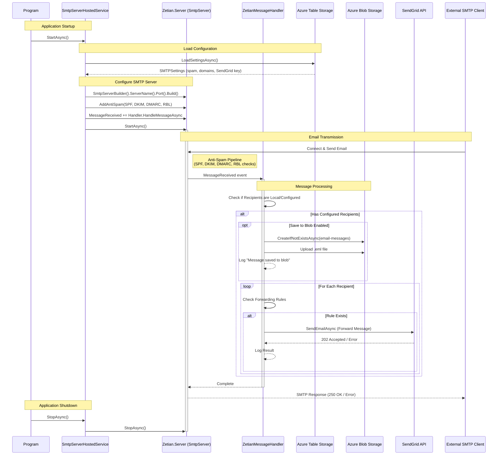

# BlazorSMTPForwarder
### Forward unlimited domains through SendGrid
## Blog Post: [Deploy Your Own Unlimited Forwarding To SendGrid SMTP Server](https://blazorhelpwebsite.com/ViewBlogPost/20082)
## Also see: [https://github.com/ADefWebserver/BlazorSMTPServer](https://github.com/ADefWebserver/BlazorSMTPServer)

## Features

*   **Unlimited Domain Forwarding**  
    Configure and manage email forwarding for an unlimited number of domains from a single instance.

*   **SendGrid Integration**  
    Leverages the SendGrid API for reliable, high-deliverability email forwarding without managing complex SMTP relay infrastructure.

*   **Advanced Routing Rules**  
    *   **Direct Forwarding:** Map specific incoming email addresses to destination addresses.
    *   **Catch-All Support:** Configure catch-all forwarding to handle any email sent to a domain that doesn't match a specific rule.

*   **Web-Based Administration**  
    *   **Dashboard:** A modern Blazor-based web interface to manage all settings and domains.
    *   **Inbox Viewer:** View received and archived emails directly in the browser.
    *   **Log Viewer:** Built-in interface to view server logs for monitoring and troubleshooting.

*   **Robust Anti-Spam Protection**  
    *   Integrated **SPF**, **DKIM**, and **DMARC** verification.
    *   **Spamhaus RBL** (Real-time Blackhole List) integration to block known spam sources.

*   **Azure Cloud Native**  
    *   **Azure Table Storage:** Uses Table Storage for scalable, low-cost configuration and logging.
    *   **Azure Blob Storage:** Archives all received emails as `.eml` files in Blob Storage for backup and auditing.

*   **Secure Access**  
    The web administration interface is protected by a configurable application password to prevent unauthorized access.

