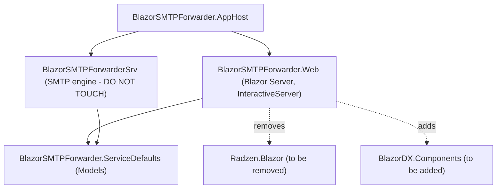
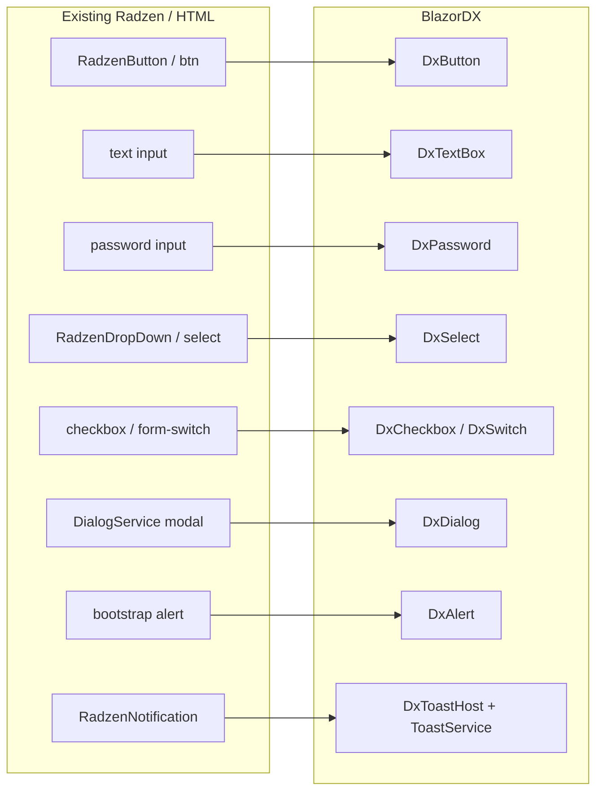
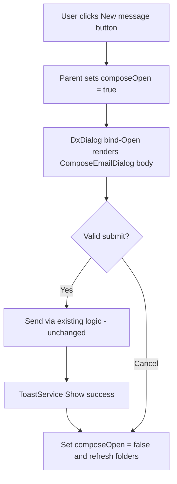
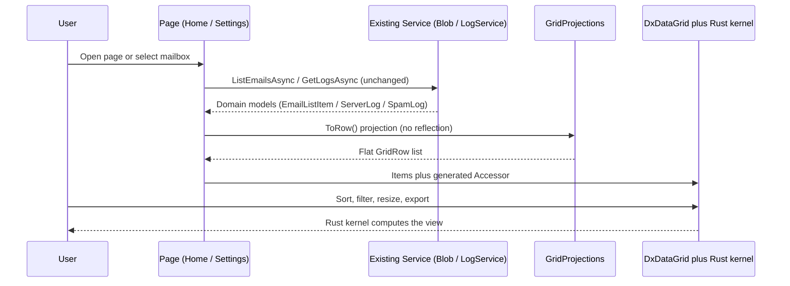
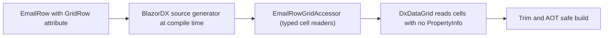
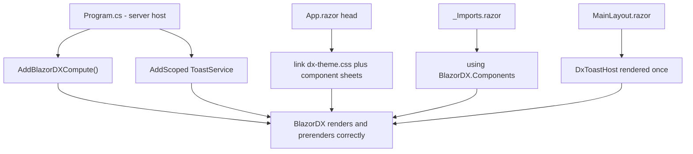
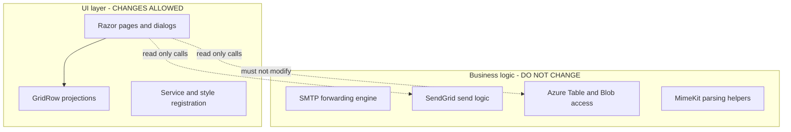
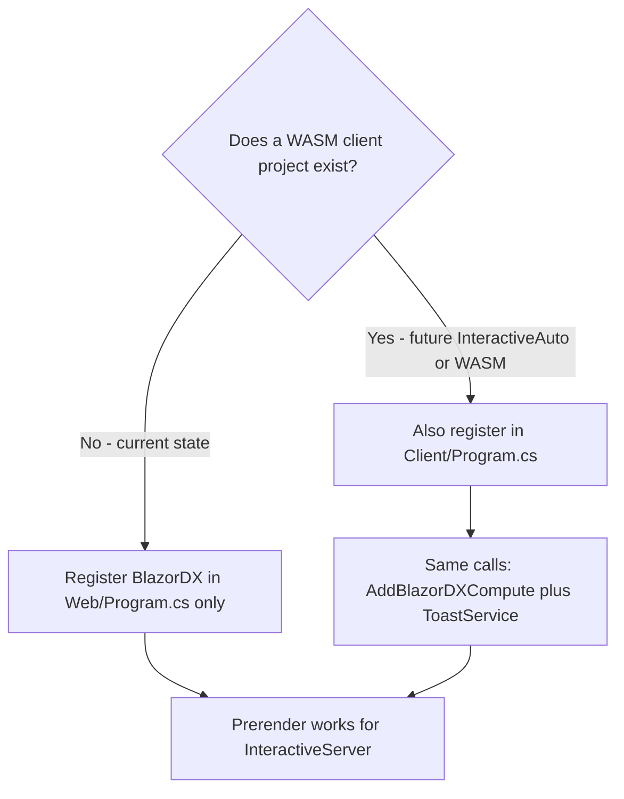
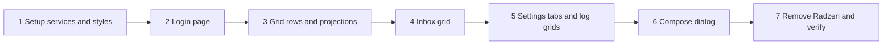

# BlazorDX UI Migration Plan — BlazorSMTPForwarder.Web

> Status: Planning · Target framework: .NET 10 · Scope: **UI layer only**
> This document describes how to replace the existing Radzen-based UI in the
> `BlazorSMTPForwarder.Web` project with **BlazorDX** equivalents, convert the
> data-heavy list pages to `DxDataGrid<TRow>`, register BlazorDX services and
> styles, and keep the entire application **AOT-safe and zero-reflection**.
>
> The SMTP forwarding, SendGrid, and Azure Storage logic is explicitly **out of
> scope** and must not change. This is a pure presentation-layer modernization.

---

## 1. Goals and Constraints

### 1.1 Goals

- Replace every Radzen UI control in `BlazorSMTPForwarder.Web` with its BlazorDX equivalent.
- Convert the **Inbox Viewer** (`Home.razor`) and the **Log Viewers** (the SPAM and Logs tabs in `Settings.razor`) to `DxDataGrid<TRow>` with sorting, filtering, column resize, and export.
- Register BlazorDX services and link the BlazorDX stylesheets so prerendering works.
- Keep all data binding **reflection-free** via the `[GridRow]` source generator.

### 1.2 Hard constraints (enforced by BlazorDX Roslyn analyzers)

| Rule | Analyzer | Impact on this migration |
| --- | --- | --- |
| No raw `MarkupString` for dynamic HTML | DX1001 | The email HTML preview must keep using a sandboxed `iframe` data URL (already the case), not `MarkupString`. |
| No `Singleton` holding UI/user state | DX1002 | `BlobEmailService`, `LogService`, `LoginService` stay `Scoped` (already the case). |
| Zero runtime reflection on binding | (build) | All grids bind through generated `*GridAccessor`; no `PropertyInfo`. |
| 1000-line file cap | DX1000 | `Settings.razor` is large; split per-tab into child components if needed. |
| `TreatWarningsAsErrors`, trim/AOT-clean | (build) | No reflection-based serialization in the UI layer. |

### 1.3 Out of scope (do not modify)

- `BlazorSMTPForwarderSrv` (the SMTP server / forwarding engine).
- `BlobEmailService` storage logic, SendGrid send logic, Azure Table/Blob access.
- The MimeKit parsing helpers in `Home.razor` (`ExtractBodyWithMimeKit`, `BuildCidMap`, etc.).

---

## 2. Current State Overview

### 2.1 Affected files

| File | Current UI tech | Migration action |
| --- | --- | --- |
| `BlazorSMTPForwarder.Web/Program.cs` | `AddRadzenComponents()` | Add BlazorDX services; keep auth + Azure clients untouched. |
| `Components/App.razor` | Radzen CSS/JS in `<head>` | Link BlazorDX stylesheets; keep Bootstrap/app.css. |
| `Components/_Imports.razor` | `@using Radzen` | Add `@using BlazorDX.Components` and grid usings. |
| `Components/Pages/Home.razor` | Radzen mail layout + `RadzenListBox` | Convert message list to `DxDataGrid<EmailRow>`. |
| `Components/Pages/Settings.razor` | `RadzenTabs`, html inputs, `RadzenDataGrid` | `DxTabs`, `DxTextBox`/`DxSwitch`/`DxSelect`, `DxDataGrid`. |
| `Components/Pages/Login.razor` | Plain html form | `DxTextBox`/`DxPassword`/`DxButton`/`DxAlert`. |
| `Components/Dialogs/ComposeEmailDialog.razor` | Radzen inputs + `DialogService` | `DxTextBox`/`DxSelect`/`DxTextArea`; host inside `DxDialog`. |
| `Components/Layout/*` | Bootstrap nav | Optional: leave nav as-is (no Radzen controls). |

### 2.2 Project / dependency structure



> **Architecture note:** `BlazorSMTPForwarder.Web` is a **Blazor Server** app using
> `AddInteractiveServerComponents()` and the `InteractiveServer` render mode. There is
> currently **no separate WebAssembly client project**. Feature requirement #3 mentions
> registering services in "both the server host and the client" — see
> [Section 6.4](#64-server-only-vs-client-host-clarification) for how this maps to the
> present single-host architecture and what changes if a WASM client is added later.

---

## 3. Feature #1 — Control-by-Control Replacement

Replace every Radzen control with its BlazorDX counterpart. The mapping below is the
authoritative reference for the migration.

### 3.1 Control mapping table

| Current (Radzen / HTML) | BlazorDX replacement | Notes |
| --- | --- | --- |
| `RadzenButton` / `<button class="btn ...">` | `DxButton` | Map `ButtonStyle` to a BlazorDX variant; keep `Click`/`@onclick` handlers. |
| `<input type="text">` / `RadzenTextBox` | `DxTextBox` | Two-way bind with `@bind-Value`. |
| `<input type="password">` | `DxPassword` | Replaces the manual show/hide toggle pattern. |
| `RadzenDropDown` / `<select>` | `DxSelect<TValue>` | `@bind-Value`; supply items via `Items`/options. |
| `<input type="checkbox" class="form-check-input">` | `DxCheckbox` | For boolean options. |
| Bootstrap `form-switch` toggle | `DxSwitch` | For the SPAM enable toggles and "Do Not Save Messages". |
| `RadzenTextArea` | `DxTextArea` | Email body field in compose dialog. |
| `RadzenTabs` / `RadzenTabsItem` | `DxTabs` | Settings page tab strip. |
| `RadzenListBox` | `DxDataGrid<EmailRow>` (Inbox) | Promoted to a grid — see Feature #2. |
| `DialogService.OpenAsync<T>()` modal | `DxDialog` (`@bind-Open`) | Confirmations and the compose dialog. |
| `RadzenProgressBar` (indeterminate) | `DxSpinner` / `DxProgress` | Loading indicators. |
| Bootstrap `alert alert-success/danger` | `DxAlert Severity="..."` | Inline status messages. |
| `RadzenNotification` / toast | `DxToastHost` + `ToastService` | Transient notifications. |

### 3.2 Mapping diagram



### 3.3 Page-by-page work items

#### 3.3.1 `Login.razor`

- Replace the password `<input type="password">` with `DxPassword` bound to `Password`.
- Replace the login `<button class="btn btn-primary">` with `DxButton`.
- Replace the `alert alert-danger` error block with `DxAlert Severity="error"` shown when `Error` is set.
- Preserve the Enter-key handler (`HandleKeyUp`) and the `LoginService.Login(...)` call unchanged.

#### 3.3.2 `ComposeEmailDialog.razor`

- Host the dialog body inside a `DxDialog` (replacing Radzen `DialogService` chrome) or keep it as a content component opened by a parent `DxDialog` — see [Section 3.4](#34-modal-strategy).
- `RadzenTextBox` → `DxTextBox` for From / To-user / Subject.
- `RadzenDropDown` (domain picker) → `DxSelect<string>` bound to `ToDomain`, items from `Domains`.
- `RadzenTextArea` → `DxTextArea` for Body.
- `RadzenButton` (Cancel/Send) → `DxButton`.
- `RadzenNotification` → remove; raise success/error via injected `ToastService` and a page-level `DxToastHost`.
- Keep `EditForm` + `DataAnnotationsValidator` and the `ComposeModel` validation attributes as-is (DataAnnotations is reflection-free at the analyzer level and is the supported validation path). The actual send logic (`HandleValidSubmitAsync`) is **unchanged**.

#### 3.3.3 `Settings.razor`

- `RadzenTabs`/`RadzenTabsItem` → `DxTabs` with one tab pane per section (General, Domains, SPAM, SendGrid, Logs).
- General tab: Server Domain `<input>` → `DxTextBox`; "Do Not Save Messages" switch → `DxSwitch`; App password field → `DxPassword`; Save/Reset buttons → `DxButton`; success/error alerts → `DxAlert`.
- Domains tab: per-domain name `<input>` → `DxTextBox`; Catch-All `<select>` → `DxSelect<CatchAllType>`; forwarding-rule `<input>` cells → `DxTextBox`; add/remove buttons → `DxButton`. Confirm domain removal with a `DxDialog`.
- SPAM tab: the four enable toggles → `DxSwitch`; Spamhaus key → `DxPassword`; the spam log grid → `DxDataGrid<SpamLogRow>` (Feature #2).
- SendGrid tab: API key → `DxPassword`; From email → `DxTextBox`; Save → `DxButton`.
- Logs tab: the server log grid → `DxDataGrid<ServerLogRow>` (Feature #2).
- Because `Settings.razor` is already large, extract each tab pane into a child component (`GeneralSettingsTab.razor`, `DomainsTab.razor`, `SpamTab.razor`, `SendGridTab.razor`, `LogsTab.razor`) to respect the 1000-line file cap (DX1000).

#### 3.3.4 `Home.razor` (Inbox)

- Replace the `RadzenDropDown` mailbox selector with `DxSelect<string>` bound to `_selectedRecipient`.
- Replace the `RadzenListBox` message list with `DxDataGrid<EmailRow>` (Feature #2).
- Replace action `RadzenButton`s (New message, Reply, Download) with `DxButton`.
- Replace the `RadzenProgressBar` loading indicator with `DxSpinner`.
- Keep the right-hand preview pane, the `iframe` data-URL rendering, and all MimeKit parsing **unchanged**.

### 3.4 Modal strategy



> Replace the imperative `DialogService.OpenAsync<ComposeEmailDialog>(...)` flow with a
> declarative `DxDialog` whose visibility is bound to a parent `bool` field. The
> `DefaultFrom` parameter is passed as a normal component parameter.

---

## 4. Feature #2 — DxDataGrid for Inbox and Log Viewers

The Inbox message list and both log viewers move to `DxDataGrid<TRow>`. The grid offloads
sorting, filtering, and large-list processing to the BlazorDX Rust/WASM compute kernel and
binds through a source-generated, reflection-free accessor.

### 4.1 Flat `[GridRow]` projections

The grid requires **flat** row types (only `string`, `int`, `double`, `bool`). The existing
domain models (`EmailListItem`, `ServerLog`, `SpamLog`) are kept as-is; new flat row types
are added and the domain objects are projected into them.

```csharp
using BlazorDX.Primitives.Grid;

[GridRow]
public sealed class EmailRow
{
    [GridColumn("Id", Order = 0)]       public string Id { get; set; } = "";
    [GridColumn("Subject", Order = 1)]  public string Subject { get; set; } = "";
    [GridColumn("From", Order = 2)]     public string From { get; set; } = "";
    [GridColumn("To", Order = 3)]       public string RecipientUser { get; set; } = "";
    [GridColumn("Received", Order = 4)] public string Received { get; set; } = "";  // pre-formatted local time
    [GridColumn("Size", Order = 5)]     public int SizeBytes { get; set; }
}

[GridRow]
public sealed class ServerLogRow
{
    [GridColumn("Time", Order = 0)]      public string Time { get; set; } = "";
    [GridColumn("Level", Order = 1)]     public string Level { get; set; } = "";
    [GridColumn("Source", Order = 2)]    public string Source { get; set; } = "";
    [GridColumn("Message", Order = 3)]   public string Message { get; set; } = "";
    [GridColumn("Exception", Order = 4)] public string Exception { get; set; } = "";
}

[GridRow]
public sealed class SpamLogRow
{
    [GridColumn("Time", Order = 0)]    public string Time { get; set; } = "";
    [GridColumn("From", Order = 1)]    public string From { get; set; } = "";
    [GridColumn("To", Order = 2)]      public string To { get; set; } = "";
    [GridColumn("Subject", Order = 3)] public string Subject { get; set; } = "";
    [GridColumn("IP", Order = 4)]      public string IP { get; set; } = "";
    [GridColumn("Reason", Order = 5)]  public string DetectionReason { get; set; } = "";
}
```

> Place these row types in the `BlazorSMTPForwarder.Web` project (e.g. a `GridRows/` folder)
> rather than in `ServiceDefaults`, so the BlazorDX source-generator package reference stays
> in the UI project. The `Id` column on `EmailRow` is what the selection handler uses to open
> the message.

### 4.2 Projection helpers (reflection-free mapping)

Map domain models to rows with plain, hand-written code — never reflection:

```csharp
internal static class GridProjections
{
    public static EmailRow ToRow(this EmailListItem m) => new()
    {
        Id = m.Id,
        Subject = string.IsNullOrWhiteSpace(m.Subject) ? "(no subject)" : m.Subject,
        From = m.From,
        RecipientUser = m.RecipientUser,
        Received = m.Received.ToLocalTime().ToString("g"),
        SizeBytes = (int)Math.Min(m.Size, int.MaxValue)
    };

    public static ServerLogRow ToRow(this ServerLog l) => new()
    {
        Time = l.Timestamp?.ToLocalTime().ToString("g") ?? "",
        Level = l.Level ?? "",
        Source = l.Source ?? "",
        Message = l.Message ?? "",
        Exception = l.Exception ?? ""
    };

    public static SpamLogRow ToRow(this SpamLog s) => new()
    {
        Time = s.Timestamp?.ToLocalTime().ToString("g") ?? "",
        From = s.From ?? "",
        To = s.To ?? "",
        Subject = s.Subject ?? "",
        IP = s.IP ?? "",
        DetectionReason = s.DetectionReason ?? ""
    };
}
```

### 4.3 Inbox grid usage

```razor
@using BlazorDX.Primitives.Grid

<DxDataGrid TRow="EmailRow"
            Items="_rows"
            Accessor="_emailAccessor"
            Selectable="true"
            Filterable="true"
            ShowColumnChooser="true"
            ShowFilterMenu="true"
            ShowExport="true" ExportFileName="inbox.csv"
            ShowExcelExport="true" ExcelFileName="inbox.xlsx"
            KeyboardNavigation="true"
            SelectionChanged="OnMessageSelected"
            RowHeight="34" ViewportHeight="600" />

@code {
    private readonly EmailRowGridAccessor _emailAccessor = new();   // generated
    private IReadOnlyList<EmailRow> _rows = Array.Empty<EmailRow>();

    private async Task RefreshMessagesAsync()
    {
        var folder = _selectedRecipient == "All" ? null : _selectedRecipient;
        var items = await EmailService.ListEmailsAsync(folder);     // unchanged service call
        _rows = items.Select(m => m.ToRow()).ToList();
    }

    private async Task OnMessageSelected(IReadOnlyList<EmailRow> sel)
    {
        if (sel.Count == 0) return;
        _selectedMessageId = sel[^1].Id;
        await LoadSelectedEmailAsync();   // existing preview/MimeKit path, unchanged
    }
}
```

> Column resize, sorting, filtering, and export are enabled via the grid parameters
> (`Filterable`, `ShowFilterMenu`, `ShowExport`/`ShowExcelExport`, and the built-in
> resizable columns). The Rust/WASM compute kernel handles these operations over large
> message and log lists.

### 4.4 Log grid usage

Both log tabs follow the same shape; only the row type and accessor differ:

```razor
<DxDataGrid TRow="ServerLogRow" Items="_logRows" Accessor="_logAccessor"
            Filterable="true" ShowFilterMenu="true" ShowExport="true"
            ExportFileName="server-logs.csv" ViewportHeight="520" />
@code {
    private readonly ServerLogRowGridAccessor _logAccessor = new();
    private IReadOnlyList<ServerLogRow> _logRows = Array.Empty<ServerLogRow>();
    // populate from LogService.GetLogsAsync(...) then .Select(l => l.ToRow())
}
```

### 4.5 Data-to-grid flow



### 4.6 Source-generator binding (why it is reflection-free)



---

## 5. Feature #3 — Service and Style Registration

### 5.1 `Program.cs` changes (server host)

Add the BlazorDX compute/interop services and the toast service. **Do not remove** the
existing Azure clients, authentication, or authorization registrations. Radzen registration
(`AddRadzenComponents()`) is removed once all pages are migrated.

```csharp
using BlazorDX.Components;   // ToastService

var builder = WebApplication.CreateBuilder(args);

builder.AddServiceDefaults();

// --- Azure clients (UNCHANGED) ---
builder.AddAzureTableServiceClient("SMTPSettings");
builder.AddAzureBlobServiceClient("emailblobs");

// --- Application services (UNCHANGED, remain Scoped per DX1002) ---
builder.Services.AddScoped<BlobEmailService>();
builder.Services.AddScoped<LoginService>();
builder.Services.AddScoped<LogService>();
builder.Services.AddScoped<AuthenticationStateProvider, CustomAuthenticationStateProvider>();
builder.Services.AddCascadingAuthenticationState();

// --- Auth (UNCHANGED) ---
builder.Services.AddAuthentication(CookieAuthenticationDefaults.AuthenticationScheme)
    .AddCookie(options =>
    {
        options.LoginPath = "/login";
        options.ExpireTimeSpan = TimeSpan.FromMinutes(20);
    });
builder.Services.AddAuthorization();

// --- BlazorDX (NEW) ---
builder.Services.AddBlazorDXCompute();                 // grid compute kernel + DOM interop
builder.Services.AddScoped<ToastService>();            // required for DxToastHost / DxToast

// --- Razor components (UNCHANGED) ---
builder.Services.AddRazorComponents()
    .AddInteractiveServerComponents();

builder.Services.AddOutputCache();
```

> **Naming note:** The BlazorDX docs (`docs/blazordx-llms.md`) register interop and the
> compute kernel via `AddBlazorDXCompute()`, which also wires up DOM interop. The feature
> brief calls this `AddBlazorDXInterop()`; use the exact method exposed by the installed
> `BlazorDX.Components` package version — confirm against the package's public API and the
> docs at https://blazordx.com. Whichever the package exposes, it must be registered in
> every host that renders BlazorDX components so prerendering succeeds.

### 5.2 `App.razor` `<head>` style links

Link `dx-theme.css` plus the per-component sheets the app actually uses, and remove the
Radzen sheet/script once migration is complete. Keep Bootstrap and the app stylesheet.

```html
<head>
    <meta charset="utf-8" />
    <meta name="viewport" content="width=device-width, initial-scale=1.0" />
    <base href="/" />
    <link rel="stylesheet" href="@Assets["lib/bootstrap/dist/css/bootstrap.min.css"]" />
    <link rel="stylesheet" href="@Assets["app.css"]" />
    <link rel="stylesheet" href="@Assets["BlazorSMTPForwarder.Web.styles.css"]" />

    <!-- BlazorDX theme + per-component sheets (NEW) -->
    <link rel="stylesheet" href="_content/BlazorDX.Components/dx-theme.css" />
    <link rel="stylesheet" href="_content/BlazorDX.Components/dx-datagrid.css" />
    <link rel="stylesheet" href="_content/BlazorDX.Components/dx-overlay.css" />
    <link rel="stylesheet" href="_content/BlazorDX.Components/dx-input.css" />

    <ImportMap />
    <link rel="icon" type="image/png" href="favicon.png" />
    <HeadOutlet @rendermode="InteractiveServer" />
</head>
```

> Link only the component sheets in use: `dx-datagrid.css` (grids), `dx-overlay.css`
> (`DxDialog`/toasts), `dx-input.css` (text boxes, selects, switches). Add `dx-form.css`
> only if `DxForm` is adopted. Linking the sheets in the host page (not lazily) ensures the
> prerendered HTML is styled correctly before interactivity starts.

### 5.3 `_Imports.razor`

```razor
@using BlazorDX.Components
@using BlazorDX.Primitives.Grid
@* remove: @using Radzen / @using Radzen.Blazor once migration is complete *@
```

### 5.4 Toast host placement

Add `<DxToastHost />` once on each page (or in `MainLayout.razor`) that raises toasts, and
inject `ToastService` where notifications are produced (e.g. compose-send success, settings
saved).



---

## 6. Feature #4 — AOT-Safe, Zero-Reflection Discipline

### 6.1 Rules to follow

- **No reflection-based binding.** Never read or write model values with `PropertyInfo`,
  `Type.GetProperty`, `dynamic`, or reflection-based serialization in the UI layer.
- **Grids bind via generated accessors only** (`EmailRowGridAccessor`, etc.).
- **Projections are hand-written** (`ToRow()` extension methods), not reflective mappers.
- **Validation** uses `System.ComponentModel.DataAnnotations` (the BlazorDX-supported path),
  which is analyzer-clean and works with `EditForm`.
- **No raw `MarkupString`** for dynamic HTML (DX1001). The email preview keeps the existing
  sandboxed `iframe` + base64 data-URL approach.
- **Keep state services `Scoped`** (DX1002) — they already are.
- **Respect the 1000-line cap** (DX1000) — split `Settings.razor` into per-tab components.
- Build must pass under `TreatWarningsAsErrors` and stay trim/AOT-clean.

### 6.2 Do-not-touch list (business logic)



### 6.3 Verification checklist

- [ ] `dotnet build` passes with warnings-as-errors (no DX1000/DX1001/DX1002 violations).
- [ ] No `using Radzen` / `Radzen.Blazor` references remain; package reference removed.
- [ ] No `PropertyInfo`, `GetProperty`, or reflective serialization in the Web project.
- [ ] Every grid uses a generated `*GridAccessor`.
- [ ] Inbox, SPAM, and Logs grids support sort, filter, resize, and export.
- [ ] `BlobEmailService`, SendGrid, and Azure Storage code is byte-for-byte unchanged.
- [ ] Prerender renders styled BlazorDX components (sheets linked in `App.razor`).
- [ ] (If AOT published) `dotnet publish` with `PublishTrimmed`/AOT produces no trim warnings.

### 6.4 Server-only vs client-host clarification

The feature brief asks to register services "in BOTH the server host and the client." The
current solution is a **single Blazor Server host** (`InteractiveServer`), so there is one
`Program.cs` to update. There is no WASM client project today.



> If the app is later converted to `InteractiveWebAssembly` or `InteractiveAuto`, add a
> client project and duplicate the `AddBlazorDXCompute()` + `AddScoped<ToastService>()`
> registrations in its `Program.cs` so the same components render and prerender on both ends.

---

## 7. Recommended Implementation Order

1. **Setup** — add the `BlazorDX.Components` package; register services in `Program.cs`; link styles in `App.razor`; update `_Imports.razor`. (Feature #3)
2. **Login page** — smallest surface; validates buttons, password input, and alert. (Feature #1)
3. **Grid rows + projections** — add `EmailRow`, `ServerLogRow`, `SpamLogRow` and `ToRow()` helpers. (Feature #2)
4. **Inbox** — convert `Home.razor` list to `DxDataGrid<EmailRow>`; keep preview/MimeKit intact. (Features #1 & #2)
5. **Settings** — split into per-tab components; migrate inputs, switches, selects, tabs; convert log grids. (Features #1 & #2)
6. **Compose dialog** — wrap in `DxDialog`; migrate inputs; route notifications through `ToastService`. (Feature #1)
7. **Cleanup** — remove Radzen package, usings, CSS/JS; run the verification checklist. (Feature #4)



---

## 8. Risks and Mitigations

| Risk | Mitigation |
| --- | --- |
| BlazorDX API names differ from the brief (`AddBlazorDXInterop` vs `AddBlazorDXCompute`). | Confirm against the installed package's public API and https://blazordx.com before coding; use the exact exposed method. |
| Beta library, not production-certified. | Pin a specific package version; smoke-test each page after migration; keep Radzen removable until sign-off. |
| Grid requires flat rows; domain models are rich. | Use the `[GridRow]` projections in Section 4.1 and hand-written `ToRow()` mappers. |
| `Settings.razor` exceeds the 1000-line cap when expanded. | Split into per-tab child components (Section 3.3.3). |
| Prerender shows unstyled components. | Link all required `dx-*.css` sheets in `App.razor` `<head>` (Section 5.2). |
| Accidental change to SMTP/SendGrid/Storage logic. | Treat Section 6.2 as a hard boundary; review diffs to ensure only UI files changed. |

---

## 9. Reference Index

- BlazorDX usage guide (local): `docs/blazordx-llms.md`
- BlazorDX docs / demo: https://blazordx.com
- BlazorDX source: https://github.com/logixrcorp/BlazorDX
- Repository: https://github.com/ADefWebserver/BlazorSMTPForwarder
