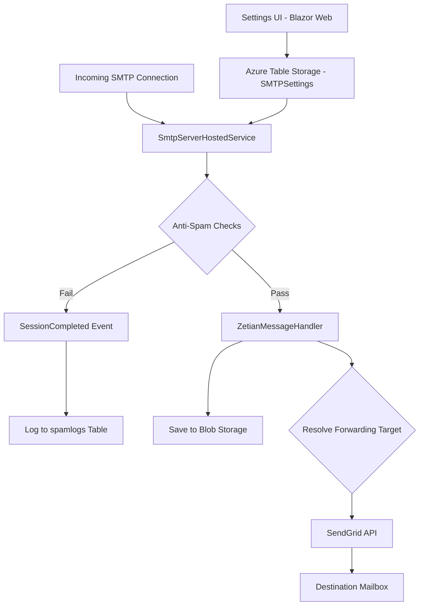
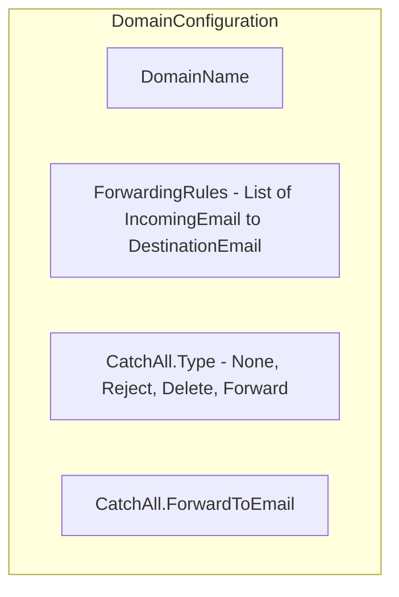
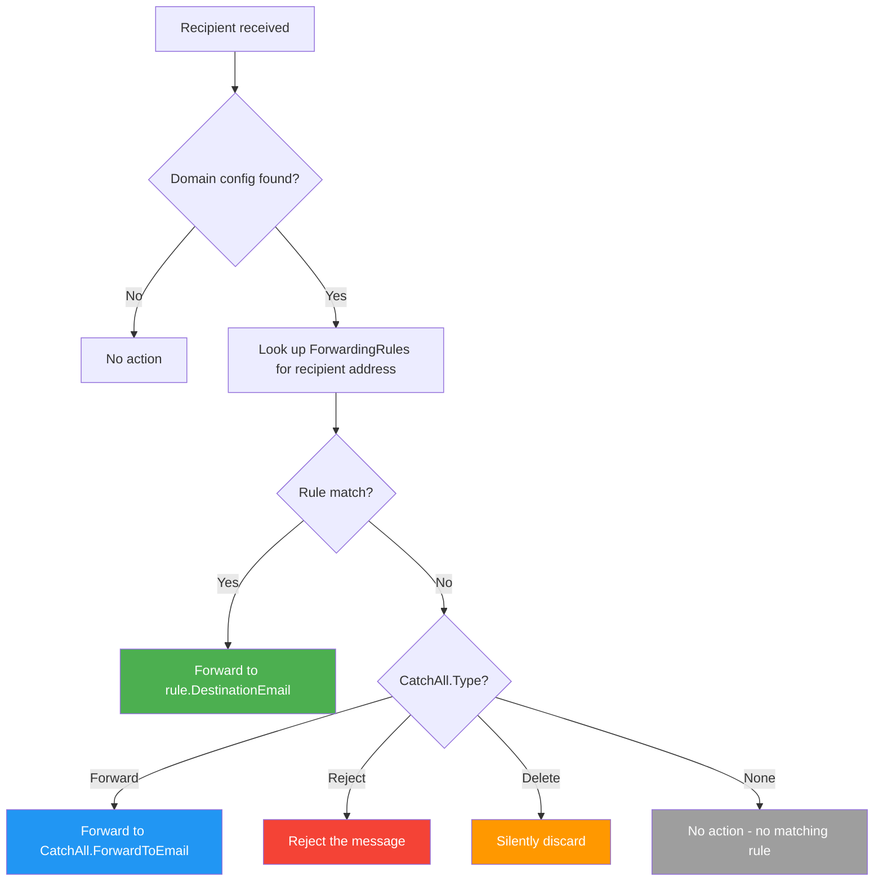
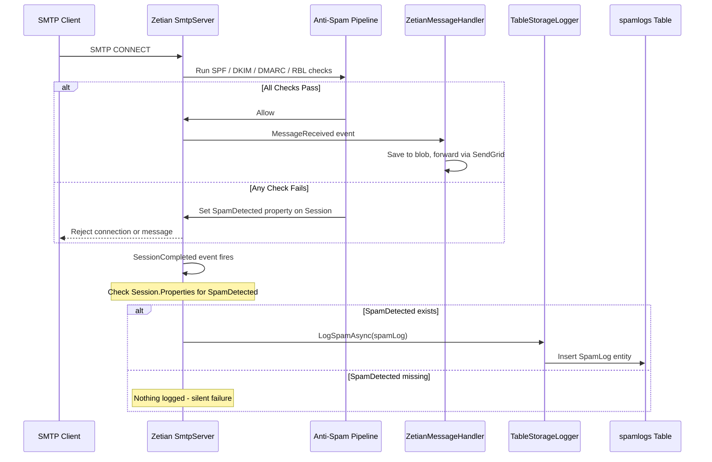
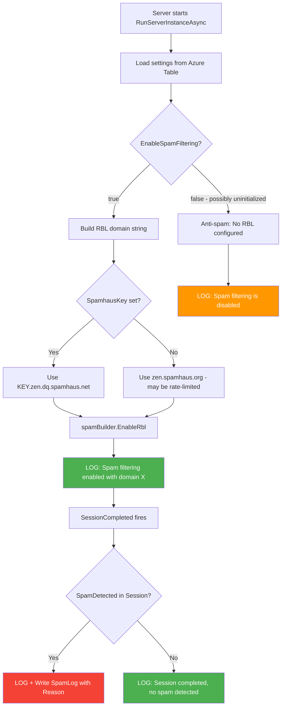

# Bug Fix Plan: Forwarding Rules & Spam Filtering

This document provides a detailed implementation plan for fixing two bugs in BlazorSMTPForwarder:

1. **Forwarding Rules do not work when Catch-All Action is `[None]`** (but work when set to `Forward`)
2. **Spam filtering is not working** even when the Spamhaus Key is set, and nothing is logged

---

## Table of Contents

- [System Overview](#system-overview)
- [Bug 1 — Forwarding Rules Broken When Catch-All Is None](#bug-1--forwarding-rules-broken-when-catch-all-is-none)
  - [Symptoms](#symptoms)
  - [Root Cause Analysis](#root-cause-analysis)
  - [Architecture Diagram](#architecture-diagram)
  - [Current vs Corrected Flow](#current-vs-corrected-flow)
  - [Implementation Steps](#implementation-steps)
- [Bug 2 — Spam Filtering Not Working and Not Logging](#bug-2--spam-filtering-not-working-and-not-logging)
  - [Symptoms](#symptoms-1)
  - [Root Cause Analysis](#root-cause-analysis-1)
  - [Spam Processing Architecture](#spam-processing-architecture)
  - [Current vs Corrected Flow](#current-vs-corrected-flow-1)
  - [Implementation Steps](#implementation-steps-1)
- [Testing Plan](#testing-plan)

---

## System Overview



Key components:

| Component | File | Role |
|-----------|------|------|
| `SmtpServerHostedService` | `BlazorSMTPForwarderSrv/Services/SmtpServerHostedService.cs` | Configures and runs the Zetian SMTP server, wires anti-spam and event handlers |
| `ZetianMessageHandler` | `BlazorSMTPForwarderSrv/Services/ZetianMessageHandler.cs` | Processes each received message: saves to blob, resolves forwarding, sends via SendGrid |
| `SmtpServerConfiguration` | `BlazorSMTPForwarderSrv/Services/SmtpServerConfiguration.cs` | Loads settings from Azure Table Storage with defaults |
| `TableStorageLogger` | `BlazorSMTPForwarderSrv/Services/TableStorageLogger.cs` | Writes to `serverlogs` and `spamlogs` Azure Tables |
| `Settings.razor` | `BlazorSMTPForwarder.Web/Components/Pages/Settings.razor` | Admin UI for domains, forwarding rules, spam settings |

---

## Bug 1 — Forwarding Rules Broken When Catch-All Is None

### Symptoms

- A domain is configured with **Catch-All Action = `[None]`** and one or more **Forwarding Rules** (Incoming Email + Destination Email).
- Emails sent to an address matching a forwarding rule are **not forwarded**.
- Changing Catch-All Action to **`Forward`** causes emails to be forwarded (but only to the catch-all address, not via the specific rule).

### Root Cause Analysis

The bug is in `ZetianMessageHandler.HandleMessageAsync()` at approximately lines 130-145.

The current code uses a **mutually exclusive `if / else if`** structure:

```csharp
// CURRENT CODE (BUGGY)
if (domainConfig.CatchAll.Type == CatchAllType.None)
{
    // Check forwarding rules
    var rule = domainConfig.ForwardingRules.FirstOrDefault(r =>
        r.IncomingEmail.Equals(recipient.Address, StringComparison.OrdinalIgnoreCase));
    if (rule != null)
    {
        await ForwardMessageAsync(sendGridClient, mimeMessage, rule.DestinationEmail);
    }
}
else if (domainConfig.CatchAll.Type == CatchAllType.Forward
         && !string.IsNullOrEmpty(domainConfig.CatchAll.ForwardToEmail))
{
    await ForwardMessageAsync(sendGridClient, mimeMessage, domainConfig.CatchAll.ForwardToEmail);
}
```

**Problem:** There are actually **two independent concerns** conflated into one `if/else if`:

1. Should the message be forwarded via a **specific forwarding rule**?
2. If no rule matched, should the message be forwarded via the **catch-all**?

The current logic treats these as mutually exclusive. In practice the user expects:

- **Forwarding rules should always be evaluated first**, regardless of the Catch-All setting.
- The Catch-All action should only apply to **unmatched** recipients.

Additionally, when `CatchAll.Type` is `Reject` or `Delete`, forwarding rules should still work — but the current code skips them entirely because the first `if` only matches `CatchAllType.None`.

### Architecture Diagram



The `CatchAllType` enum values:

| Value | Meaning |
|-------|---------|
| `None` (3) | No catch-all behaviour; only forwarding rules apply |
| `Reject` (0) | Reject emails for unmatched recipients |
| `Delete` (1) | Silently discard emails for unmatched recipients |
| `Forward` (2) | Forward unmatched recipients to `CatchAll.ForwardToEmail` |

### Current vs Corrected Flow



### Implementation Steps

#### Step 1: Fix the forwarding logic in `ZetianMessageHandler.cs`

**File:** `BlazorSMTPForwarderSrv/Services/ZetianMessageHandler.cs`

Replace the `if / else if` block (lines ~130-145) with logic that always checks forwarding rules first, then falls through to the catch-all:

```csharp
// CORRECTED CODE
foreach (var recipient in message.Recipients)
{
    var domainConfig = domains.FirstOrDefault(d =>
        recipient.Address.EndsWith("@" + d.DomainName,
            StringComparison.OrdinalIgnoreCase));

    if (domainConfig != null)
    {
        // 1. Always check forwarding rules first
        var rule = domainConfig.ForwardingRules
            .FirstOrDefault(r => r.IncomingEmail
                .Equals(recipient.Address, StringComparison.OrdinalIgnoreCase));

        if (rule != null)
        {
            _logger.LogInformation(
                "Forwarding message for {Recipient} to {Destination}",
                recipient.Address, rule.DestinationEmail);
            await _tableLogger.LogInformationAsync(
                $"Forwarding message for {recipient.Address} to {rule.DestinationEmail}",
                nameof(ZetianMessageHandler));
            await ForwardMessageAsync(
                sendGridClient, mimeMessage, rule.DestinationEmail);
        }
        else
        {
            // 2. No rule matched — apply catch-all action
            switch (domainConfig.CatchAll.Type)
            {
                case CatchAllType.Forward
                    when !string.IsNullOrEmpty(domainConfig.CatchAll.ForwardToEmail):
                    _logger.LogInformation(
                        "Catch-all forwarding message for {Recipient} to {Destination}",
                        recipient.Address,
                        domainConfig.CatchAll.ForwardToEmail);
                    await _tableLogger.LogInformationAsync(
                        $"Catch-all forwarding message for {recipient.Address} "
                        + $"to {domainConfig.CatchAll.ForwardToEmail}",
                        nameof(ZetianMessageHandler));
                    await ForwardMessageAsync(
                        sendGridClient, mimeMessage,
                        domainConfig.CatchAll.ForwardToEmail);
                    break;

                case CatchAllType.Reject:
                    _logger.LogInformation(
                        "Rejecting message for unmatched recipient {Recipient}",
                        recipient.Address);
                    await _tableLogger.LogInformationAsync(
                        $"Rejecting message for unmatched recipient {recipient.Address}",
                        nameof(ZetianMessageHandler));
                    break;

                case CatchAllType.Delete:
                    _logger.LogInformation(
                        "Deleting message for unmatched recipient {Recipient}",
                        recipient.Address);
                    await _tableLogger.LogInformationAsync(
                        $"Deleting message for unmatched recipient {recipient.Address}",
                        nameof(ZetianMessageHandler));
                    break;

                case CatchAllType.None:
                default:
                    _logger.LogInformation(
                        "No forwarding rule and no catch-all for {Recipient}",
                        recipient.Address);
                    await _tableLogger.LogInformationAsync(
                        $"No forwarding rule and no catch-all for {recipient.Address}",
                        nameof(ZetianMessageHandler));
                    break;
            }
        }
    }
}
```

**Key change:** Forwarding rules are checked **unconditionally** for every recipient. The `CatchAll.Type` switch only runs when no rule matched.

#### Step 2: Update the Settings UI to always show Forwarding Rules

**File:** `BlazorSMTPForwarder.Web/Components/Pages/Settings.razor`

Currently (line 138), the Forwarding Rules table is only rendered when `CatchAll.Type == CatchAllType.None`:

```razor
@if (domain.CatchAll.Type == CatchAllType.None)
```

Change this so that the Forwarding Rules table is **always visible**, allowing users to define rules regardless of the catch-all setting:

```razor
@if (domain.CatchAll.Type == CatchAllType.None
     || domain.CatchAll.Type == CatchAllType.Forward
     || domain.CatchAll.Type == CatchAllType.Reject
     || domain.CatchAll.Type == CatchAllType.Delete)
```

Or simply remove the `@if` guard entirely so the rules section always renders.

#### Step 3: Improve validation logging at startup

**File:** `BlazorSMTPForwarderSrv/Services/SmtpServerHostedService.cs`

The existing validation (lines ~113-128) only warns when `CatchAll.Type == None` with no rules. Extend it to also warn when `CatchAll.Type == Forward` and `ForwardToEmail` is empty:

```csharp
if (domain.CatchAll.Type == CatchAllType.Forward
    && string.IsNullOrEmpty(domain.CatchAll.ForwardToEmail))
{
    var msg = $"Domain '{domain.DomainName}' has Catch-All set to Forward "
            + "but no forward-to email is specified.";
    await _tableLogger.LogErrorAsync(msg, null, nameof(SmtpServerHostedService));
}
```

---

## Bug 2 — Spam Filtering Not Working and Not Logging

### Symptoms

- The Spamhaus Key is configured in the Settings UI and spam filtering is enabled.
- Emails from known-spam IP addresses are **not being blocked**.
- The `spamlogs` table contains **no entries** — not even failed attempts.
- The `serverlogs` table shows no spam-related log entries.

### Root Cause Analysis

There are **three distinct issues** causing spam filtering to silently fail:

#### Issue A: `EnableSpamFiltering` is never initialized in Azure Table Storage

**File:** `BlazorSMTPForwarderSrv/Services/SmtpServerConfiguration.cs` (lines 61-68)

The `EnsureProperty` calls initialize default values for every setting **except** `EnableSpamFiltering`:

```csharp
EnsureProperty("ServerName", "localhost");
EnsureProperty("SpamhausKey", "");
EnsureProperty("EnableSpfCheck", false);
EnsureProperty("EnableDkimCheck", false);
EnsureProperty("EnableDmarcCheck", false);
EnsureProperty("SendGridApiKey", "");
EnsureProperty("SendGridFromEmail", "");
EnsureProperty("DoNotSaveMessages", false);
// ❌ MISSING: EnsureProperty("EnableSpamFiltering", false);
```

When the property does not exist in the table entity, the read at line 80:

```csharp
model.EnableSpamFiltering = entity.GetBoolean("EnableSpamFiltering") ?? false;
```

...correctly defaults to `false`. However, even after the user enables spam filtering via the UI and saves, the value is written to the table. The real risk is that the **first-time initialization path** (`needsUpdate = true`) upserts the entity **without** `EnableSpamFiltering`, and subsequent reads rely on the UI having been used at least once to set it.

#### Issue B: No diagnostic logging around anti-spam configuration

**File:** `BlazorSMTPForwarderSrv/Services/SmtpServerHostedService.cs` (lines 137-152)

The anti-spam setup block has no logging at all:

```csharp
_smtpServer.AddAntiSpam(spamBuilder =>
{
    if (settings.EnableSpfCheck) spamBuilder.EnableSpf();
    if (settings.EnableDkimCheck) spamBuilder.EnableDkim();
    if (settings.EnableDmarcCheck) spamBuilder.EnableDmarc();

    if (settings.EnableSpamFiltering)
    {
        var rblDomain = !string.IsNullOrEmpty(settings.SpamhausKey)
            ? $"{settings.SpamhausKey}.zen.dq.spamhaus.net"
            : "zen.spamhaus.org";

        spamBuilder.EnableRbl(rblDomain);
    }
});
```

Without logging here, there is **no way to tell** whether `EnableSpamFiltering` was `true` or `false` when the server started, or which RBL domain was resolved.

#### Issue C: Spam detection event handler lacks logging and may not trigger

**File:** `BlazorSMTPForwarderSrv/Services/SmtpServerHostedService.cs` (lines 158-173)

The `SessionCompleted` handler only writes to the `spamlogs` table if a `"SpamDetected"` property exists in `e.Session.Properties`. There are two problems:

1. **No logging outside the if-block** — if `SpamDetected` is never set (due to the Zetian library not matching, or the RBL lookup failing silently), there is no indication that the session completed at all.
2. **No reason captured** — even when spam is detected, the `SpamLog` model has no field to record which check failed (SPF, DKIM, DMARC, or RBL).

### Spam Processing Architecture



### Current vs Corrected Flow



### Implementation Steps

#### Step 1: Add `EnsureProperty` for `EnableSpamFiltering`

**File:** `BlazorSMTPForwarderSrv/Services/SmtpServerConfiguration.cs`

Add the missing initialization alongside the other `EnsureProperty` calls (after the `DoNotSaveMessages` line):

```csharp
EnsureProperty("ServerName", "localhost");
EnsureProperty("SpamhausKey", "");
EnsureProperty("EnableSpfCheck", false);
EnsureProperty("EnableDkimCheck", false);
EnsureProperty("EnableDmarcCheck", false);
EnsureProperty("SendGridApiKey", "");
EnsureProperty("SendGridFromEmail", "");
EnsureProperty("DoNotSaveMessages", false);
EnsureProperty("EnableSpamFiltering", false);  // <-- ADD THIS
```

This ensures the property is always present in the table entity and is included in the initial upsert.

#### Step 2: Add diagnostic logging to the anti-spam configuration block

**File:** `BlazorSMTPForwarderSrv/Services/SmtpServerHostedService.cs`

Wrap each anti-spam configuration step with a log statement:

```csharp
// Configure Anti-Spam
_smtpServer.AddAntiSpam(spamBuilder =>
{
    if (settings.EnableSpfCheck)
    {
        spamBuilder.EnableSpf();
        _logger.LogInformation("Anti-spam: SPF check enabled.");
    }
    if (settings.EnableDkimCheck)
    {
        spamBuilder.EnableDkim();
        _logger.LogInformation("Anti-spam: DKIM check enabled.");
    }
    if (settings.EnableDmarcCheck)
    {
        spamBuilder.EnableDmarc();
        _logger.LogInformation("Anti-spam: DMARC check enabled.");
    }

    if (settings.EnableSpamFiltering)
    {
        var rblDomain = !string.IsNullOrEmpty(settings.SpamhausKey)
            ? $"{settings.SpamhausKey}.zen.dq.spamhaus.net"
            : "zen.spamhaus.org";

        spamBuilder.EnableRbl(rblDomain);
        _logger.LogInformation(
            "Anti-spam: RBL check enabled with domain {RblDomain}.",
            rblDomain);
    }
    else
    {
        _logger.LogInformation(
            "Anti-spam: Spam filtering (RBL) is disabled.");
    }
});

await _tableLogger.LogInformationAsync(
    $"Anti-spam configured: SPF={settings.EnableSpfCheck}, "
    + $"DKIM={settings.EnableDkimCheck}, "
    + $"DMARC={settings.EnableDmarcCheck}, "
    + $"RBL={settings.EnableSpamFiltering}",
    nameof(SmtpServerHostedService));
```

This produces a clear log entry on every restart showing exactly which checks are active.

#### Step 3: Add a `DetectionReason` field to `SpamLog`

**File:** `BlazorSMTPForwarder.ServiceDefaults/Models/SpamLog.cs`

Add a new property to capture why the email was flagged:

```csharp
public class SpamLog : ITableEntity
{
    public string PartitionKey { get; set; } = default!;
    public string RowKey { get; set; } = default!;
    public DateTimeOffset? Timestamp { get; set; }
    public ETag ETag { get; set; }

    public string? SessionId { get; set; }
    public string? TransactionId { get; set; }
    public string? From { get; set; }
    public string? To { get; set; }
    public string? Subject { get; set; }
    public string? BlobPath { get; set; }
    public string? IP { get; set; }
    public string? DetectionReason { get; set; }  // <-- ADD THIS
}
```

#### Step 4: Enhance the `SessionCompleted` handler with comprehensive logging

**File:** `BlazorSMTPForwarderSrv/Services/SmtpServerHostedService.cs`

Replace the current handler with one that always logs and captures detection reasons:

```csharp
_smtpServer.SessionCompleted += async (s, e) =>
{
    var ip = (e.Session.RemoteEndPoint as IPEndPoint)?.Address.ToString()
             ?? "Unknown";

    if (e.Session.Properties.ContainsKey("SpamDetected"))
    {
        // Build a reason string from available session properties
        var reasons = new List<string>();
        if (e.Session.Properties.ContainsKey("SpfResult"))
            reasons.Add($"SPF={e.Session.Properties["SpfResult"]}");
        if (e.Session.Properties.ContainsKey("DkimResult"))
            reasons.Add($"DKIM={e.Session.Properties["DkimResult"]}");
        if (e.Session.Properties.ContainsKey("DmarcResult"))
            reasons.Add($"DMARC={e.Session.Properties["DmarcResult"]}");
        if (e.Session.Properties.ContainsKey("RblResult"))
            reasons.Add($"RBL={e.Session.Properties["RblResult"]}");

        var reasonStr = reasons.Count > 0
            ? string.Join("; ", reasons)
            : "Unknown (SpamDetected flag set but no detail properties)";

        _logger.LogWarning(
            "Spam detected from {IP}. Reason: {Reason}", ip, reasonStr);

        var spamLog = new SpamLog
        {
            PartitionKey = "Spam",
            RowKey = (DateTime.MaxValue.Ticks - DateTime.UtcNow.Ticks)
                     .ToString("d19"),
            Timestamp = DateTimeOffset.UtcNow,
            SessionId = e.Session.Properties.TryGetValue("SessionId", out var sid)
                        ? sid?.ToString() : null,
            IP = ip,
            From = e.Session.Properties.TryGetValue("MailFrom", out var from)
                   ? from?.ToString() : null,
            To = e.Session.Properties.TryGetValue("RcptTo", out var to)
                 ? to?.ToString() : null,
            DetectionReason = reasonStr,
        };

        await _tableLogger.LogSpamAsync(spamLog);
        await _tableLogger.LogInformationAsync(
            $"Spam logged from {ip}: {reasonStr}",
            nameof(SmtpServerHostedService));
    }
    else
    {
        _logger.LogDebug(
            "Session completed for {IP} - no spam detected.", ip);
    }
};
```

#### Step 5: Display `DetectionReason` in the Settings UI spam log grid

**File:** `BlazorSMTPForwarder.Web/Components/Pages/Settings.razor`

Add a column for `DetectionReason` in the spam logs data grid so admins can see why each email was flagged.

---

## Testing Plan

### Bug 1 — Forwarding Rules

| Test Case | Catch-All | Forwarding Rule | Expected Result |
|-----------|-----------|-----------------|-----------------|
| TC-1 | `None` | `alice@example.com` maps to `alice@gmail.com` | Email to `alice@example.com` forwards to `alice@gmail.com` |
| TC-2 | `Forward` (to `catchall@gmail.com`) | `alice@example.com` maps to `alice@gmail.com` | Email to `alice@example.com` forwards to `alice@gmail.com` (rule takes priority) |
| TC-3 | `Forward` (to `catchall@gmail.com`) | No rule for `bob@example.com` | Email to `bob@example.com` forwards to `catchall@gmail.com` (catch-all applies) |
| TC-4 | `Reject` | `alice@example.com` maps to `alice@gmail.com` | Email to `alice@example.com` forwards to `alice@gmail.com`; email to `bob@example.com` is rejected |
| TC-5 | `Delete` | No rules | Email silently discarded, logged |
| TC-6 | `None` | No rules | Email not forwarded, logged |

### Bug 2 — Spam Filtering

| Test Case | Description | Expected Result |
|-----------|-------------|-----------------|
| TS-1 | Enable spam filtering, set valid Spamhaus key, restart server | `serverlogs` shows "Anti-spam: RBL check enabled with domain KEY.zen.dq.spamhaus.net" |
| TS-2 | Disable spam filtering, restart server | `serverlogs` shows "Anti-spam: Spam filtering (RBL) is disabled" |
| TS-3 | Send email from a known-listed IP | Entry appears in `spamlogs` table with `DetectionReason` populated |
| TS-4 | Send clean email | `serverlogs` shows "Session completed - no spam detected" at Debug level |
| TS-5 | Enable spam filtering with empty Spamhaus key | `serverlogs` shows warning "SPAMHAUS enabled but SPAMHAUS key not set", RBL falls back to `zen.spamhaus.org` |
| TS-6 | Fresh deployment, check Azure Table | `EnableSpamFiltering` property exists in `SMTPSettings` table entity with value `false` |

### Files Modified Summary

| File | Changes |
|------|---------|
| `BlazorSMTPForwarderSrv/Services/ZetianMessageHandler.cs` | Replace if/else-if with rules-first then catch-all-switch logic |
| `BlazorSMTPForwarderSrv/Services/SmtpServerConfiguration.cs` | Add `EnsureProperty("EnableSpamFiltering", false)` |
| `BlazorSMTPForwarderSrv/Services/SmtpServerHostedService.cs` | Add anti-spam config logging; enhance SessionCompleted handler |
| `BlazorSMTPForwarder.ServiceDefaults/Models/SpamLog.cs` | Add `DetectionReason` property |
| `BlazorSMTPForwarder.Web/Components/Pages/Settings.razor` | Always show Forwarding Rules table; add DetectionReason column to spam grid |
