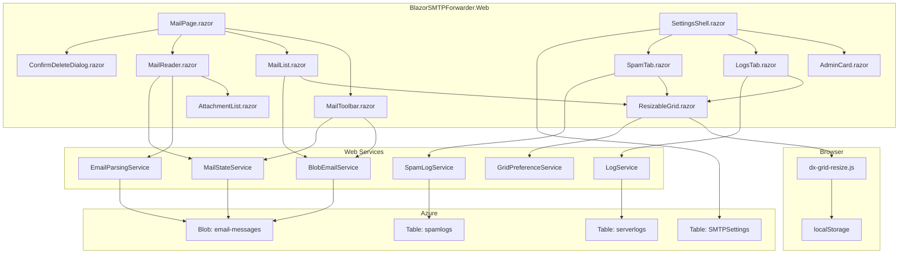
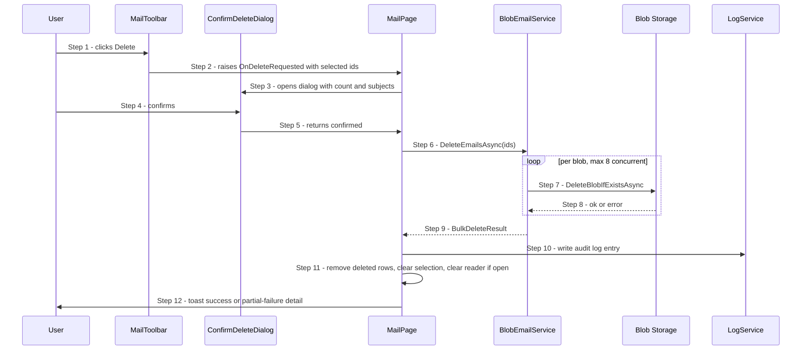
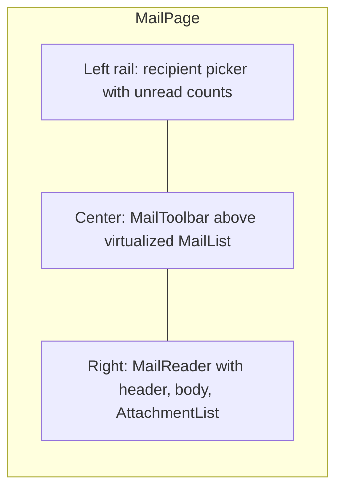
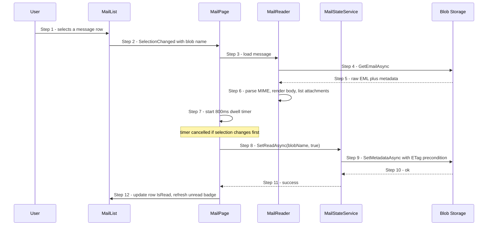
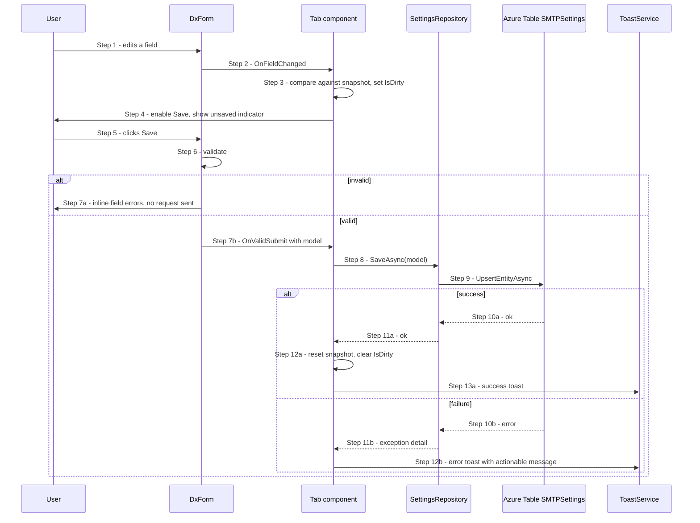
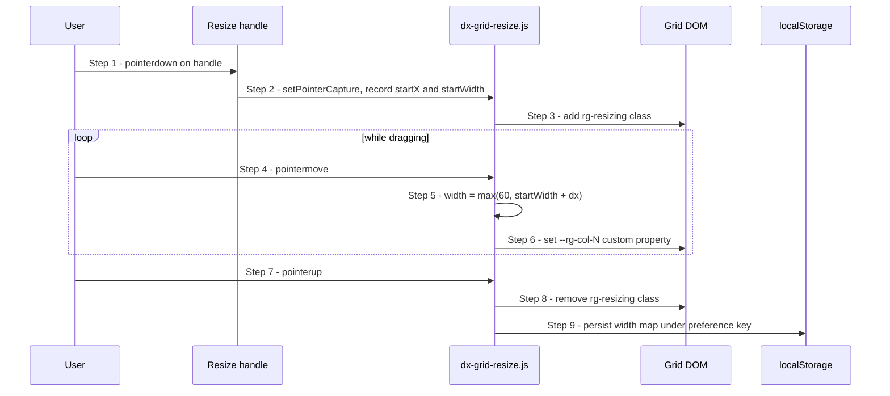
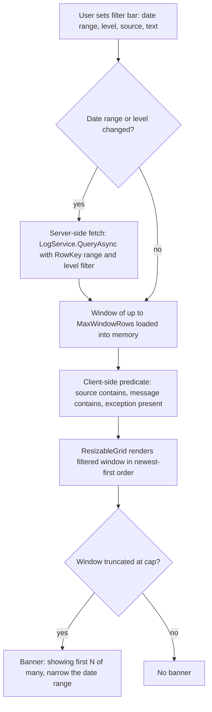
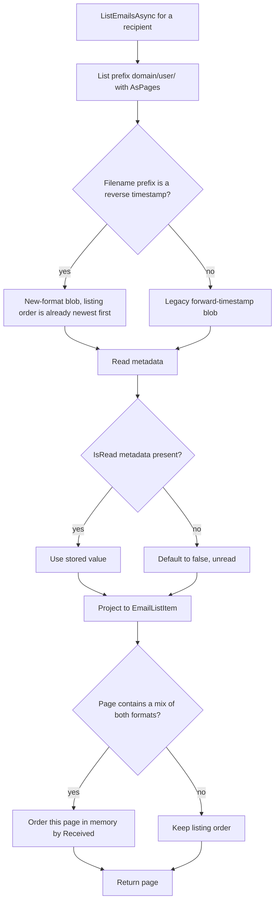

# Email Management &amp; Admin UI Implementation Plan

## 1. Overview

This document specifies the implementation plan for four feature areas in **BlazorSMTPForwarder**:

| # | Feature | Primary Surface |
|---|---------|-----------------|
| F1 | Allow an email to be deleted | `Home.razor`, `BlobEmailService` |
| F2 | Modern email management interface | New `Components/Mail/*` component set |
| F3 | Fix the look of all Admin screens | `Settings.razor` + all `*Tab.razor` |
| F4 | Resizable / filterable log grids | `LogsTab.razor`, `SpamTab.razor`, new JS interop |

### 1.1 Decisions Locked In

These were confirmed with the product owner and are **not** open for reinterpretation during implementation:

- **Delete is a hard delete.** The blob is removed immediately from Azure Blob Storage after an explicit confirmation dialog. There is no undo and no retention window.
- **There are no mail folders.** Every message lives in a single flat list per recipient. Trash and Spam folders, and any move-between-folders action, are explicitly excluded.
- **Message read/unread state lives in blob metadata** on the `.eml` blob, not in a separate table.
- **Column resizing is delivered via custom JS interop** layered over `DxDataGrid`, because BlazorDX 0.2.0 exposes no `Resizable` parameter. Widths persist in `localStorage`.
- **Grids are not user-sortable.** Lists render in a fixed, service-defined order (newest first). No sort carets, no click-to-sort headers.
- **Log querying is hybrid**: server-side narrowing by date range and level, then client-side filtering within the returned window.
- **Admin restyling** covers layout/typography consistency, migration to `DxForm` with validation and dirty-state, and toast feedback on every save or error. Dark mode and mobile layout are explicitly out of scope.

### 1.2 Out of Scope

- Mail folders of any kind (Trash, Spam, Archive) and moving messages between them
- User-controlled column sorting in any grid
- Conversation/thread grouping
- Star/flag on messages
- Full-text body search
- Reading-pane layout toggle
- Dark theme, responsive/mobile layouts
- Any change to the SMTP receive path in `BlazorSMTPForwarderSrv` beyond the message filename prefix and two new metadata keys

---

## 2. Current State

### 2.1 Relevant Existing Code

| Path | Role |
|------|------|
| `BlazorSMTPForwarder.Web/Components/Pages/Home.razor` | Two-column inbox; recipient selector + `DxDataGrid<EmailRow>` + preview iframe |
| `BlazorSMTPForwarder.Web/Services/BlobEmailService.cs` | Blob CRUD: `GetRecipientFoldersAsync`, `ListEmailsAsync`, `GetEmailAsync`, `DeleteEmailAsync` |
| `BlazorSMTPForwarder.Web/Services/LogService.cs` | Cursor pagination over `serverlogs` table |
| `BlazorSMTPForwarder.Web/GridRows/*.cs` | `[GridRow]` source-generated accessors: `EmailRow`, `ServerLogRow`, `SpamLogRow` |
| `BlazorSMTPForwarder.ServiceDefaults/Models/*.cs` | `EmailListItem`, `EmailMessage`, `ServerLog`, `SpamLog`, `DomainConfiguration` |
| `BlazorSMTPForwarderSrv/Services/ZetianMessageHandler.cs` | Writes `.eml` to blob as `domain/user/timestamp_guid.eml` with Subject/From metadata |
| `BlazorSMTPForwarder.Web/Components/Pages/*Tab.razor` | Settings tabs: General, Domains, SendGrid, Spam, Logs |

### 2.2 Storage Layout Today

```
email-messages (container)
  └── {domain}/{user}/{timestamp}_{guid}.eml     (blob metadata: Subject, From, RecipientUser)
```

### 2.3 Known Gaps

1. `DeleteEmailAsync` exists on the service but is not reliably surfaced, has no bulk variant, and has no post-delete list reconciliation.
2. No read/unread concept anywhere in the model.
3. Attachments are never enumerated; the preview iframe renders the body only.
4. `ListEmailsAsync` enumerates an entire recipient prefix on every load — there is no paging.
5. `DxDataGrid` renders fixed-width columns; there is no resize affordance.
6. Log grids paginate with an opaque Previous/Next cursor and offer no date, level, or text filtering.
7. Settings tabs each hand-roll their own markup, spacing, and save buttons — no shared shell.

---

## 3. Target Architecture

### 3.1 Component and Service Structure



### 3.2 Storage Layout

The blob path is **unchanged**:

```
{domain}/{user}/{prefix}_{guid}.eml
```

Because there are no folders, no relocation of existing blobs is required. The only naming change is the `{prefix}` component, which switches from a forward timestamp to a reverse timestamp so that lexicographic blob-listing order equals newest-first (Section 5.8). Legacy blobs with a forward timestamp continue to be listed and read without modification.

### 3.3 Blob Metadata Contract

Azure blob metadata keys must be valid C# identifiers and are case-insensitive on read. The full set:

| Key | Written By | Values | Notes |
|-----|-----------|--------|-------|
| `Subject` | Srv (existing) | free text | URL-encoded if non-ASCII |
| `From` | Srv (existing) | free text | URL-encoded if non-ASCII |
| `RecipientUser` | Srv (existing) | `user@domain` | |
| `IsRead` | Web (new) | `true` / `false` | Absent means `false` |
| `HasAttachments` | Srv (new) | `true` / `false` | Absent means unknown; Web computes lazily |

> **Azure metadata constraint:** values must be ASCII. `ZetianMessageHandler` already handles this for `Subject`/`From`; reuse the same encoder for any new value.

**Concurrency:** all metadata writes must use `SetMetadataAsync` with an `ETag` precondition captured from the preceding read. On `412 Precondition Failed`, re-read and retry once; on a second failure, surface a warning toast and refresh the list.

---

## 4. Feature F1 — Delete an Email

### 4.1 Behavior

- Delete is available from the list toolbar (single or multi-select) and from the reader pane.
- A confirmation dialog is **always** shown. It names the message count and states that the action is permanent.
- Deletion is a hard blob delete with `DeleteSnapshotsOption.IncludeSnapshots`.
- Partial failure in a bulk delete is reported: succeeded blobs are removed from the list, failures are listed by subject in an error toast.
- Every delete writes a `ServerLog` row at level `Info` with source `MailUi` recording the blob name and count.

### 4.2 Service Changes — `BlobEmailService`

```csharp
// Existing, retained:
Task<bool> DeleteEmailAsync(string blobName, CancellationToken ct = default);

// New:
Task<BulkDeleteResult> DeleteEmailsAsync(
    IReadOnlyCollection<string> blobNames,
    CancellationToken ct = default);

public sealed record BulkDeleteResult(
    IReadOnlyList<string> Deleted,
    IReadOnlyList<DeleteFailure> Failed);

public sealed record DeleteFailure(string BlobName, string Reason);
```

Implementation notes:

- Fan out with a bounded `SemaphoreSlim` (degree 8) rather than a sequential loop; a 200-message bulk delete must not block the circuit for minutes.
- Treat `404 BlobNotFound` as success — the message is already gone, which is the caller's desired end state.
- Do **not** wrap the whole operation in a single try/catch that swallows everything; catch per blob so one bad name does not abort the batch.
- Validate that each `blobName` starts with the currently selected recipient prefix before deleting. This prevents a tampered client from deleting another recipient's mail.

### 4.3 Delete Flow



### 4.4 UI Details

- Toolbar Delete button is disabled when the selection is empty.
- The `Delete` keyboard shortcut maps to the same command; `Shift+Delete` is **not** given a bypass-confirmation meaning.
- If the currently open message is among the deleted set, the reader pane clears to the empty state.
- After a delete, do not refetch the whole list from Blob Storage. Remove the rows locally; a full refetch on every delete makes bulk operations feel broken.

---

## 5. Feature F2 — Modern Email Interface

### 5.1 Scope (Confirmed)

1. Multi-select with bulk actions (delete, mark read/unread)
2. Attachment list with per-attachment download
3. Infinite scroll / virtualized message list

Read/unread tracking is included because "mark read" is a selected bulk action and because a modern list must visually distinguish unread mail.

There are no folders. The list always shows every stored message for the selected recipient, newest first.

### 5.2 Layout



Grid template: `260px minmax(360px, 1fr) minmax(420px, 1.4fr)`. Below 1100px the reader collapses and selecting a message replaces the list (single-pane mode). This is a CSS-only concession, not a full responsive effort.

### 5.3 New and Changed Models

`EmailListItem` gains two fields. It is a `record`, so add positional parameters at the end to limit breakage.

```csharp
public record EmailListItem(
    string Id,
    string Subject,
    string From,
    DateTimeOffset Received,
    string RecipientUser,
    long Size,
    string BlobName,
    string Container,
    bool IsRead = false,
    bool HasAttachments = false);
```

`EmailRow` gains the two state flags. Column order below is the fixed presentation order; it is not user-reorderable and not user-sortable.

```csharp
[GridRow]
public sealed class EmailRow
{
    [GridColumn("Id", Order = 0)]        public string Id { get; set; } = "";
    [GridColumn("", Order = 1)]          public bool IsRead { get; set; }
    [GridColumn("", Order = 2)]          public bool HasAttachments { get; set; }
    [GridColumn("From", Order = 3)]      public string From { get; set; } = "";
    [GridColumn("Subject", Order = 4)]   public string Subject { get; set; } = "";
    [GridColumn("To", Order = 5)]        public string RecipientUser { get; set; } = "";
    [GridColumn("Received", Order = 6)]  public string Received { get; set; } = "";
    [GridColumn("Size", Order = 7)]      public string Size { get; set; } = "";
}
```

`Received` and `Size` stay as display strings, formatted in `GridProjections` (relative dates such as `10:42 AM` for today, `Mon` for this week, `Mar 4` otherwise; size as `12 KB`). This is safe only because the grid is never sorted by those columns — ordering is always by blob name, which is chronological by construction.

### 5.4 New Service — `MailStateService`

Scoped. Owns all blob-metadata mutations so that ETag handling lives in exactly one place.

```csharp
public interface IMailStateService
{
    Task<bool> SetReadAsync(string blobName, bool isRead, CancellationToken ct = default);

    Task<BulkStateResult> SetReadAsync(
        IReadOnlyCollection<string> blobNames, bool isRead, CancellationToken ct = default);

    Task<int> GetUnreadCountAsync(string recipientFolder, CancellationToken ct = default);
}

public sealed record BulkStateResult(
    IReadOnlyList<string> Updated,
    IReadOnlyList<DeleteFailure> Failed);
```

`GetUnreadCountAsync` enumerates blob metadata for the recipient prefix, which is cheap relative to downloading content but still a full prefix scan. Cache the result per recipient for the lifetime of the page and adjust it locally on read/unread/delete rather than recomputing.

### 5.5 Read/Unread Flow



The dwell timer prevents arrow-key scrolling through a list from marking everything read.

### 5.6 Attachments — `EmailParsingService`

New scoped service. `BlobEmailService` returns raw EML; parsing belongs elsewhere.

```csharp
public sealed record ParsedEmail(
    string Subject,
    string From,
    IReadOnlyList<string> To,
    DateTimeOffset Date,
    string? HtmlBody,
    string? TextBody,
    IReadOnlyList<AttachmentInfo> Attachments);

public sealed record AttachmentInfo(
    string FileName,
    string ContentType,
    long Size,
    string ContentId,          // for inline cid: resolution
    bool IsInline,
    int PartIndex);            // stable index used to re-fetch the part

public interface IEmailParsingService
{
    Task<ParsedEmail> ParseAsync(string rawEml, CancellationToken ct = default);

    Task<(Stream Content, string ContentType, string FileName)> GetAttachmentAsync(
        string blobName, int partIndex, CancellationToken ct = default);
}
```

Use **MimeKit** (`MimeKit` NuGet package) for parsing. Hand-rolled MIME parsing is not acceptable — multipart boundaries, quoted-printable, base64, and RFC 2047 encoded words are all in play and already partially mis-handled by the current 4KB header sniff.

**Attachment download** is served through a minimal API endpoint rather than Blazor Server interop, so the browser gets a real file stream:

```csharp
// BlazorSMTPForwarder.Web/Program.cs
app.MapGet("/api/mail/attachment", async (
        string blobName, int part,
        IEmailParsingService parser, HttpContext ctx, CancellationToken ct) =>
    {
        var (stream, contentType, fileName) = await parser.GetAttachmentAsync(blobName, part, ct);
        return Results.File(stream, contentType, fileName);
    })
    .RequireAuthorization();
```

#### Security requirements for attachments

These are non-negotiable and map to OWASP A01 (Broken Access Control) and A03 (Injection):

1. **Authorization** — the endpoint carries `.RequireAuthorization()`. Never expose it anonymously.
2. **Path traversal** — validate `blobName` against a whitelist regex `^[A-Za-z0-9._@-]+/[A-Za-z0-9._@-]+/[A-Za-z0-9._-]+\.eml$` and reject anything containing `..`. Do not concatenate user input into a blob path.
3. **Filename header injection** — sanitize `FileName` before it reaches `Content-Disposition`: strip CR, LF, quotes, and path separators; fall back to `attachment-{part}.bin` if the result is empty.
4. **Content type** — never echo the MIME part's declared `Content-Type` for a `text/html` or `image/svg+xml` attachment inline. Force `application/octet-stream` with `Content-Disposition: attachment` for anything not in a small image/PDF/plain-text allowlist. Add `X-Content-Type-Options: nosniff`.
5. **Size cap** — refuse to buffer parts larger than a configured `MailSettings:MaxAttachmentBytes` (default 25 MB); stream instead of `ToArray()`.

### 5.7 HTML Body Rendering

The body preview already uses an `iframe`. Harden it, since the content is attacker-controlled by definition:

- Render into a `srcdoc` iframe with `sandbox="allow-popups allow-popups-to-escape-sandbox"` — note the absence of `allow-scripts` and `allow-same-origin`. Both must stay absent.
- Sanitize the HTML server-side with **HtmlSanitizer** (`Ganss.Xss` NuGet package) before it reaches the iframe: strip `<script>`, `<iframe>`, `<object>`, `<embed>`, event handler attributes, and `javascript:` / `data:` URLs on anchors.
- Block remote images by default. Rewrite `src` to a placeholder and show a "Show remote content" bar; only on user click swap in the real URLs. This is both a privacy (tracking pixel) and a bandwidth control.
- Resolve inline `cid:` references to the attachment endpoint with `&disposition=inline` for the allowlisted image types only.

### 5.8 Virtualized List / Infinite Scroll

- Wrap the list in the BlazorDX `DxVirtualize<T>` component (or `Microsoft.AspNetCore.Components.Web.Virtualization.Virtualize` if the DX variant lacks an items-provider overload).
- `BlobEmailService.ListEmailsAsync` gains paging so the whole recipient prefix is not enumerated up front:

```csharp
Task<EmailPage> ListEmailsAsync(
    string recipientFolder,
    int pageSize = 100,
    string? continuationToken = null,
    CancellationToken ct = default);

public sealed record EmailPage(
    IReadOnlyList<EmailListItem> Items,
    string? ContinuationToken);
```

Use `GetBlobsAsync(prefix: ...).AsPages(continuationToken, pageSize)` from the Azure SDK. Do **not** call `ListEmailsAsync` and then `Skip/Take` — that re-enumerates the container on every scroll.

**Ordering is fixed and comes from the blob name, not from a sort step.** Blob listing returns names in lexicographic order, and filenames start with a timestamp, so ascending name order equals ascending time order. To get newest-first straight from the listing, change the `ZetianMessageHandler` filename prefix to a **reverse timestamp** (`(DateTime.MaxValue.Ticks - DateTime.UtcNow.Ticks).ToString("d19")`), matching the pattern already used for `ServerLog.RowKey`. Legacy blobs keep forward timestamps and therefore sort after all new mail; the compatibility shim orders the mixed set in memory for the first page only, during the transition window.

### 5.9 Multi-Select and Bulk Actions

| Action | Enabled When | Result |
|--------|--------------|--------|
| Delete | ≥1 selected | Confirm dialog, then hard delete (F1) |
| Mark read | ≥1 selected, any unread | Metadata write, rows restyle |
| Mark unread | ≥1 selected, any read | Metadata write, rows restyle |
| Download .eml | exactly 1 selected | Streams raw blob |
| Reply | exactly 1 selected | Opens `ComposeEmailDialog` prefilled |

Selection mechanics: header checkbox toggles all loaded rows, `Ctrl+Click` toggles one, `Shift+Click` extends a range. Selection is cleared on recipient change.

Bulk operations of more than 25 items show a `DxProgress` bar bound to a completion counter reported by the service via `IProgress<int>`.

---

## 6. Feature F3 — Admin Screen Restyling

### 6.1 Goals

1. One consistent card/section layout, spacing scale, and type scale across all Settings tabs.
2. Settings forms migrate to `DxForm<TModel>` with data-annotation validation and explicit dirty-state.
3. Toast feedback on every save and every error.

### 6.2 Shared Building Blocks

Create `BlazorSMTPForwarder.Web/Components/Admin/`:

| Component | Purpose |
|-----------|---------|
| `AdminPageHeader.razor` | Title, subtitle, right-aligned action slot |
| `AdminCard.razor` | Bordered surface with header, optional description, body slot, footer slot |
| `AdminFormActions.razor` | Save/Cancel pair; Save disabled unless dirty and valid; shows inline spinner while saving |
| `AdminEmptyState.razor` | Icon, message, optional CTA — used by empty grids and the empty reading pane |
| `AdminFieldHelp.razor` | Consistent helper/description text under an input |

### 6.3 Design Tokens

Add `wwwroot/css/admin.css`, imported after the BlazorDX theme sheets in `App.razor` so it can override them:

```css
:root {
  --admin-space-1: 4px;   --admin-space-2: 8px;   --admin-space-3: 12px;
  --admin-space-4: 16px;  --admin-space-5: 24px;  --admin-space-6: 32px;

  --admin-card-radius: 8px;
  --admin-card-border: 1px solid var(--dx-border, #e2e5e9);
  --admin-card-bg: var(--dx-surface, #fff);
  --admin-card-shadow: 0 1px 2px rgba(16, 24, 40, .06);

  --admin-font-page-title: 600 20px/28px system-ui, sans-serif;
  --admin-font-section:    600 15px/22px system-ui, sans-serif;
  --admin-font-body:       400 14px/20px system-ui, sans-serif;
  --admin-font-help:       400 12px/18px system-ui, sans-serif;

  --admin-label-width: 220px;
  --admin-field-max:   520px;
}
```

Rules: every tab body is a stack of `AdminCard`s separated by `--admin-space-5`. Inputs never stretch past `--admin-field-max`. Labels are left-aligned at `--admin-label-width` on wide viewports and stack above the input below 900px.

### 6.4 Form Models

Each tab gets a `[DxFormModel]` POCO with data annotations, replacing loose `DxTextBox`/`DxSwitch` bindings.

```csharp
[DxFormModel(Name = "general_settings", Description = "Server identity and storage behavior.")]
public sealed class GeneralSettingsForm
{
    [Required, StringLength(255)]
    [Display(Name = "Server Name", Order = 0, Prompt = "mail.example.com")]
    public string ServerName { get; set; } = "";

    [StringLength(128, MinimumLength = 8)]
    [Display(Name = "Application Password", Order = 1)]
    public string? AppPassword { get; set; }

    [Display(Name = "Do Not Save Messages", Order = 2)]
    public bool DoNotSaveMessages { get; set; }
}
```

Equivalent models: `SendGridSettingsForm` (API key required when a from-address is set; from-address must be a valid email), `SpamSettingsForm` (Spamhaus key required when RBL is enabled), `DomainForm` (domain name matches a hostname regex; forwarding rule addresses validated as email).

> **Credential handling:** the SendGrid API key and app password are existing configuration values. Render them with `DxPassword`, never echo the stored value back into the DOM on load (show a `••••••••` placeholder and treat an unchanged field as "leave as-is"), and never log them. Do not alter, clear, or rotate any stored value as a side effect of this restyling work.

### 6.5 Dirty State and Save Flow



Additional rules:

- Navigating away from a dirty tab raises a confirm dialog wired through `NavigationManager.RegisterLocationChangingHandler`.
- The `DxTabs` header shows a dot on any tab with unsaved changes.
- `Cancel` restores the snapshot without a round trip.
- Introduce `SettingsRepository` (scoped) to centralize `SMTPSettings` table reads/writes; today each tab talks to `TableServiceClient` directly, which is why save semantics differ between tabs.

### 6.6 Per-Tab Work Items

| Tab | Changes |
|-----|---------|
| General | `AdminCard` "Server Identity" + "Storage"; migrate to `GeneralSettingsForm`; password placeholder semantics |
| Domains | `AdminCard` per domain; forwarding rules become an editable `DxDataGrid` with add/remove rows; catch-all in its own card; validation on domain and address format |
| SendGrid | Single card; API key as `DxPassword` with masked load; "Send test email" button with inline result |
| Spam | Toggles in a "Detection" card; Spamhaus key conditionally required and hidden when RBL is off; log grid moves to its own card (see F4) |
| Logs | Filter bar card above the grid card (see F4) |
| Login | Center card on `LoginLayout`, consistent type scale, error message region reserved so layout does not jump |

---

## 7. Feature F4 — Log Grid Resize and Filter

### 7.1 Shared Wrapper — `ResizableGrid.razor`

A thin wrapper around `DxDataGrid<TRow>` that adds resize handles and persists widths.

```razor
@typeparam TRow
<div class="rg-root" @ref="_host" data-rg-key="@PreferenceKey">
    <DxDataGrid TRow="TRow"
                Items="Items"
                Accessor="Accessor"
                Selectable="@Selectable"
                Filterable="true"
                ShowFilterMenu="true"
                ShowColumnChooser="true"
                ShowExport="true"
                ExportFileName="@ExportFileName"
                KeyboardNavigation="true"
                RowHeight="@RowHeight"
                ViewportHeight="@ViewportHeight" />
</div>
```

```csharp
[Parameter, EditorRequired] public IReadOnlyList<TRow> Items { get; set; } = default!;
[Parameter, EditorRequired] public object Accessor { get; set; } = default!;
[Parameter, EditorRequired] public string PreferenceKey { get; set; } = default!;
[Parameter] public bool Selectable { get; set; }
[Parameter] public string ExportFileName { get; set; } = "export.csv";
[Parameter] public int RowHeight { get; set; } = 34;
[Parameter] public int ViewportHeight { get; set; } = 520;

protected override async Task OnAfterRenderAsync(bool first)
{
    if (first)
        _handle = await JS.InvokeAsync<IJSObjectReference>(
            "dxGridResize.attach", _host, PreferenceKey);
}
```

Implement `IAsyncDisposable` and call `dxGridResize.detach` — leaving pointer listeners bound after a Blazor Server component disposes leaks handlers across circuit reuse.

### 7.2 JS Interop — `wwwroot/js/dx-grid-resize.js`

ES module, loaded lazily via `IJSRuntime.InvokeAsync<IJSObjectReference>("import", "./js/dx-grid-resize.js")`.

Responsibilities:

1. Locate the grid's header cell elements inside the wrapper root.
2. Inject a 5px-wide absolutely positioned `.rg-handle` at the right edge of each header cell (except the last).
3. On `pointerdown`, capture the pointer, record start X and current width, and add a `.rg-resizing` class to the root (which sets `user-select: none` and `cursor: col-resize`).
4. On `pointermove`, compute `newWidth = max(MIN_WIDTH, startWidth + dx)` where `MIN_WIDTH = 60`, and apply it. Apply widths by writing to a `<colgroup>` on the table if one exists, otherwise set `style.width` on the header cell and the matching `td` of each rendered row via a CSS custom property (`--rg-col-{i}`) on the root — the custom-property route avoids per-row DOM writes and survives virtualized row recycling.
5. On `pointerup`, release capture, remove the class, and persist.
6. Double-click on a handle resets that column to auto width and removes its stored entry.

Persistence:

```js
const KEY_PREFIX = 'dxgrid.widths.';
function save(prefKey, widths) {
  localStorage.setItem(KEY_PREFIX + prefKey, JSON.stringify(widths));
}
function load(prefKey) {
  try { return JSON.parse(localStorage.getItem(KEY_PREFIX + prefKey)) ?? {}; }
  catch { return {}; }   // corrupt entry must not break the grid
}
```

Stored shape is `{ "0": 120, "3": 480 }` — a sparse index-to-pixel map. Store a `v` version field alongside it; if the column count for a key changes, discard the stored widths rather than misapplying them to the wrong columns.

`GridPreferenceService` (scoped C#) wraps `dxGridResize.reset(prefKey)` so a "Reset columns" button in each grid toolbar can clear stored widths.

### 7.3 Resize Interaction



On mount, `attach` reads the stored map and applies the custom properties before the first paint of the header, so there is no visible width jump.

### 7.4 Row Ordering

Grids are **not user-sortable**. Header cells are not clickable, render no sort caret, and the JS module wires `pointerdown` only on the resize handles — it must not attach a header `click` handler.

Order is fixed by the data source:

| Grid | Order | Source |
|------|-------|--------|
| Mail list | Newest first | Blob name (reverse timestamp), Section 5.8 |
| Server logs | Newest first | `ServerLog.RowKey` is already reverse-chronological |
| Spam logs | Newest first | `SpamLog.RowKey` is already reverse-chronological |

Because nothing is sorted client-side, `ServerLogRow.Time` and `SpamLogRow.Time` stay as preformatted display strings and no `GridSorter` helper is needed. If sorting is ever added later, those two properties must first change to `DateTimeOffset` — sorting the current string form would order lexicographically and produce wrong results.

### 7.5 Filtering — Hybrid Model



#### Server-side narrowing

`ServerLog.RowKey` is `(DateTime.MaxValue.Ticks - UtcNow.Ticks).ToString("d19")`, i.e. reverse-chronological. A time window `[from, to]` maps to a RowKey range with the bounds **swapped**:

```csharp
static string RowKeyFor(DateTimeOffset t) =>
    (DateTime.MaxValue.Ticks - t.UtcDateTime.Ticks).ToString("d19");

// newest bound produces the SMALLEST RowKey
var rkLow  = RowKeyFor(to);
var rkHigh = RowKeyFor(from);

var filter = $"PartitionKey eq 'Log' and RowKey ge '{rkLow}' and RowKey le '{rkHigh}'";
if (levels is { Count: > 0 })
    filter += " and (" + string.Join(" or ", levels.Select(l => $"Level eq '{Escape(l)}'")) + ")";
```

Getting the bound order backwards is the single most likely bug in this feature — write a unit test for it.

> **Injection note:** `Level` values come from a fixed enum-like set (`Info`, `Warning`, `Error`); validate against that allowlist rather than interpolating arbitrary user text into the OData filter. Free-text search stays client-side precisely to avoid building filter strings from user input.

#### New `LogService` API

```csharp
public sealed record LogQuery(
    DateTimeOffset From,
    DateTimeOffset To,
    IReadOnlyCollection<string>? Levels = null,
    int MaxRows = 5000);

public sealed record LogWindow(
    IReadOnlyList<ServerLog> Rows,
    bool Truncated);

Task<LogWindow> QueryAsync(LogQuery query, CancellationToken ct = default);
```

Stream pages with `QueryAsync(filter).AsPages()` and stop once `MaxRows` is reached, setting `Truncated = true`. Never materialize an unbounded result — `GetAllLogsAsync()` in its current form will eventually take down the circuit on a busy server and should be removed or made internal.

A parallel `SpamLogService` provides the same shape over the `spamlogs` table (filter facets: date range, detection reason, sender IP).

#### Filter bar

`LogFilterBar.razor`, placed in an `AdminCard` above the grid:

| Control | Bound To | Default |
|---------|----------|---------|
| Date range preset `DxSelect` | Last 1h / 24h / 7d / 30d / Custom | Last 24h |
| Custom from/to `DxDatePicker` | `LogQuery.From` / `To` | hidden unless Custom |
| Level multi-select | `LogQuery.Levels` | all |
| Source `DxTextBox` | client predicate | empty |
| Message contains `DxTextBox` | client predicate | empty |
| Errors only `DxSwitch` | client predicate | off |
| Refresh / Reset columns buttons | — | — |

Text predicates debounce at 250ms. Changing a *server-side* facet triggers a refetch; changing a client-side facet does not.

The existing Previous/Next cursor pagination is removed — it is superseded by the windowed query plus scroll.

---

## 8. Backward Compatibility

No blobs are relocated and no folder segment is introduced, so there is no migration step. Two compatibility concerns remain, both handled on the read path.



Rules:

- Missing `IsRead` or `HasAttachments` metadata is never an error; both default as documented in Section 3.3.
- Reverse-timestamp names sort before all legacy forward-timestamp names, so once the transition window has passed, mixed pages stop occurring naturally and the in-memory reorder becomes a no-op.
- `HasAttachments` on legacy blobs is unknown. Compute it lazily on first open and write the metadata back, so the paperclip indicator fills in over time rather than requiring a bulk backfill.

Update `ZetianMessageHandler` to set `IsRead=false` and `HasAttachments`, and to use the reverse-timestamp filename prefix from Section 5.8. The blob path itself is unchanged.

---

## 9. Implementation Phases

| Phase | Deliverable | Depends On |
|-------|-------------|------------|
| 1 | `MimeKit` + `Ganss.Xss` packages; `EmailParsingService`; attachment endpoint with all Section 5.6 security controls | — |
| 2 | Metadata contract; `MailStateService`; `ZetianMessageHandler` writes `IsRead`/`HasAttachments` and reverse-timestamp names; legacy read shim | 1 |
| 3 | F1 — `DeleteEmailsAsync`, confirm dialog, toolbar wiring, audit logging | 2 |
| 4 | F2a — `MailPage` shell, paged + virtualized `MailList`, multi-select | 2 |
| 5 | F2b — `MailReader`, sanitized body iframe, `AttachmentList`, read-on-dwell | 1, 4 |
| 6 | F2c — bulk mark read/unread, unread counts, download, reply | 4, 5 |
| 7 | F4a — `dx-grid-resize.js`, `ResizableGrid`, `GridPreferenceService`; adopt in mail list and both log grids | — |
| 8 | F4b — `LogService.QueryAsync`, `SpamLogService`, `LogFilterBar`, truncation banner; remove cursor pagination | 7 |
| 9 | F3 — admin tokens, `AdminCard` family, `SettingsRepository`, `DxForm` migration per tab, dirty-state guard, toasts | — |

Phases 7 and 9 have no dependency on the mail work and can run in parallel with 1–6.

---

## 10. Testing

### 10.1 Unit

- `RowKeyFor` bound inversion: a `[from, to]` window yields `rkLow <= rkHigh` and selects exactly the expected rows.
- Reverse-timestamp filename generation produces names that sort newest-first lexicographically, and sort before any legacy forward-timestamp name.
- Blob-name validation regex rejects `..`, absolute paths, URL-encoded traversal, and cross-recipient prefixes.
- Attachment filename sanitizer strips CR/LF/quotes and falls back on empty results.
- HTML sanitizer removes `<script>`, `on*` attributes, `javascript:` hrefs, and rewrites remote `img` sources.
- `EmailListItem` projection defaults `IsRead` to `false` and `HasAttachments` to `false` when metadata is absent.
- MIME parsing: multipart/alternative, multipart/mixed with attachments, inline `cid:` images, RFC 2047 encoded subjects, quoted-printable bodies.

### 10.2 Integration (Azurite)

- Bulk delete of 100 blobs with one pre-deleted name reports 100 successes.
- ETag conflict on `SetReadAsync` retries once and then surfaces a warning.
- Paged listing returns stable, non-overlapping pages across continuation tokens, in newest-first order.
- A container holding both legacy and new-format names returns a correctly ordered first page.
- `QueryAsync` honors `MaxRows` and sets `Truncated`.

### 10.3 UI / Manual

- Resize a column, reload the page, width persists; double-click resets it.
- Change the column set via the column chooser, confirm stored widths are discarded rather than misapplied.
- Click a grid header — nothing happens, no caret appears, no reorder occurs.
- Arrow-key through 20 messages quickly — none are marked read.
- Dwell on one message for one second — it is marked read and the unread badge decrements.
- Leave a dirty settings tab — the navigation guard fires.
- Save with an invalid domain — inline errors show and no table write occurs.
- Open a message containing a tracking pixel — no outbound request until "Show remote content" is clicked (verify in the network panel).

---

## 11. Risks

| Risk | Impact | Mitigation |
|------|--------|------------|
| BlazorDX header DOM changes between versions, breaking the resize module | Resize silently stops working | Feature-detect header cells in `attach`; if none found, no-op and log to console instead of throwing. Pin the BlazorDX version. |
| Metadata write races between browser tabs | Lost read state | ETag preconditions with single retry, then refresh |
| Large recipient prefixes make listing slow | Sluggish list load | Paged `AsPages` listing, reverse-timestamp names, bounded page size |
| Malicious HTML in a received message | XSS against the admin session | Server-side sanitize, sandboxed iframe without `allow-scripts` or `allow-same-origin`, blocked remote content |
| Attachment endpoint used to read arbitrary blobs | Data disclosure | `RequireAuthorization`, strict blob-name allowlist regex, recipient-prefix check |
| Hard delete with no undo and no Trash | Irrecoverable user error | Mandatory confirmation dialog naming the count and stating the action is permanent; Delete is never the default-focused button |
| Unbounded log query | Circuit exhaustion | Remove `GetAllLogsAsync`; enforce `MaxRows`; default to a 24h window |
| Users expect click-to-sort on grid headers | Perceived as broken | Headers render with a default cursor and no hover affordance so they do not look interactive |

---

## 12. Open Items for the Implementer

1. Confirm whether BlazorDX `DxDataGrid` renders a `<colgroup>`; this determines which width-application strategy in Section 7.2 step 4 is used.
2. Confirm `DxVirtualize<T>` supports an items-provider (async paging) callback; fall back to `Microsoft.AspNetCore.Components.Web.Virtualization.Virtualize` if not.
3. Confirm that `DxDataGrid` does not attach its own header click-to-sort behavior. If it does, it must be suppressed to honor the fixed-order decision in Section 7.4.
4. Decide a message retention policy — currently none, and with no Trash there is no staging area. If one is later wanted, it belongs in `BlazorSMTPForwarderSrv` as a timed cleanup, not in the web tier.
